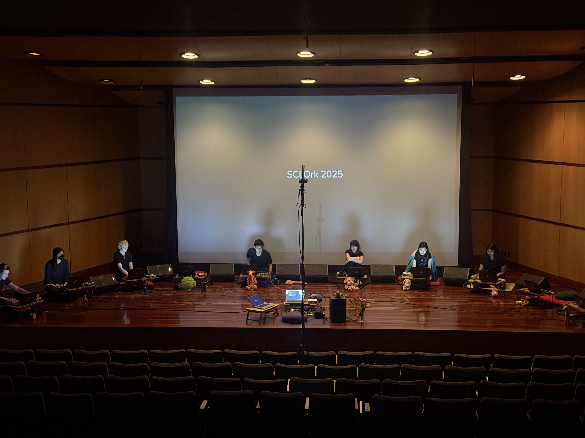
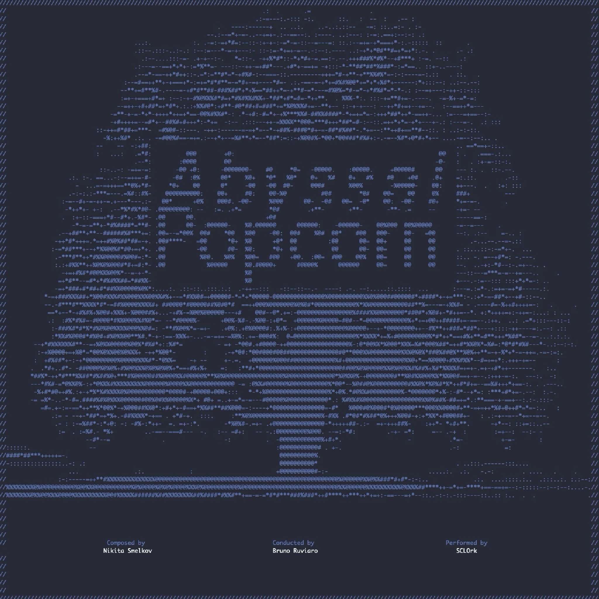

# AbyssalPopcorn

A laptop orchestra piece for **9 players and 1 conductor**, combining SuperCollider synthesis, live MIDI control, and networked conduction. The piece is inspired by compositional techniques of Krzysztof Penderecki reimagined for a laptop orchestra setting. 

## 🪄 Instructions

1. **Preparation**
   - Every player must ensure that both the software and hardware requirements (below) are met.

2. **Conductor**
   - Use the `Conductor.scd` file for written instructions to call queues for the players.

3. **Visual Score**
   - Reference the visual score in [`Abyssal Popcorn Visual Sketch.pdf`](Abyssal%20Popcorn%20Visual%20Sketch.pdf) for rehearsal and performance.
   - Initially, I planned to embed the visual score directly into the `.scd` files (like in `penderecki-groupW6.scd`), but that approach was unnecessary for our performance and postponed.  
     *If you plan to perform a future rendition and want to incorporate it, contact me.*

4. **Player Files**
   - Each player has a dedicated SuperCollider file.
   - `Player 5` corresponds to `PX.scd`.
   - Players are divided into `R` (Right) and `L` (Left), with player `X` in the center (neither R nor L).

5. **Sound Generation**
   - Each performer should load and run `AP_Ndef.scd`, which defines the synth producing the drone texture.
   - Once started, it can remain running throughout the piece, sustaining an **indefinite evolving drone**.

6. **Performance Control**
   - All sound variation, movement, and dynamics are controlled via the **Korg nanoKONTROL2** MIDI controller.

---

## ⚙️ Technical Requirements

The piece is designed for:

- 9 Players  
- 1 Conductor (communicating via a chat interface)

**Required Equipment:**

- 🖥️ 10 laptops  
- 🎚️ 9 audio interfaces  
- 🔊 9 speakers  
- 🎛️ 9 Korg nanoKONTROL2 MIDI controllers  
- 🔌 Necessary cables to connect all devices

This setup was used for the **SCLOrk 2025 concert**:

  

---

## 💻 Software Requirements

Each player must have:

- **SuperCollider** installed  
- The **SCLOrk Quarks** for Korg nanoKONTROL mapping  
  👉 [SCLOrkTools GitHub Repository](https://github.com/SCLOrkHub/SCLOrkTools/)

You may use another MIDI controller if preferred — just rewrite the handling logic in `AP_Ndef.scd` accordingly.

---

## 🖼️ Visuals

The cover for the streaming release was created directly in the **SuperCollider editor**.

  

---

## 📬 Contact

For help, performance inquiries, or resources:  
**📧 nikitasmelk@gmail.com**

---
